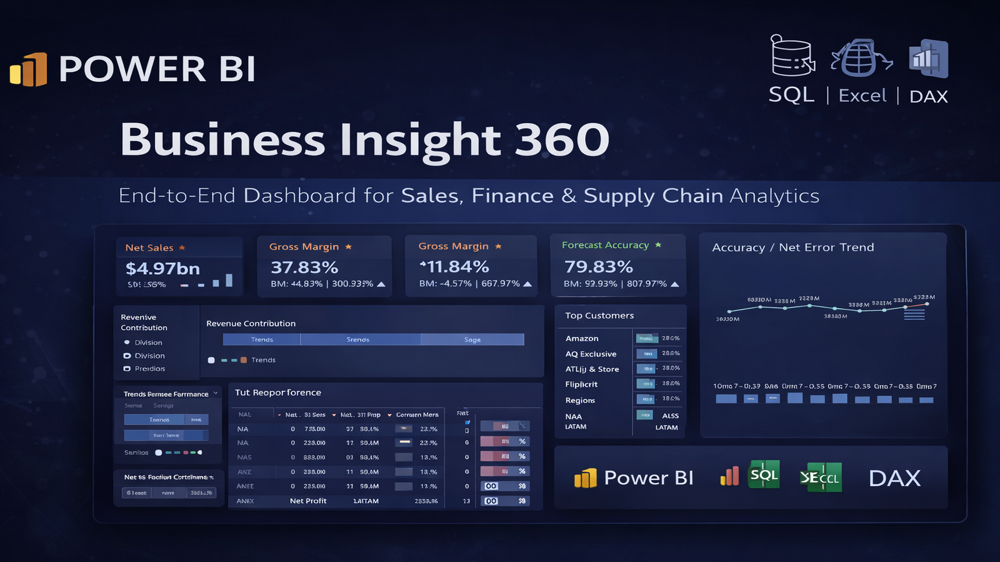
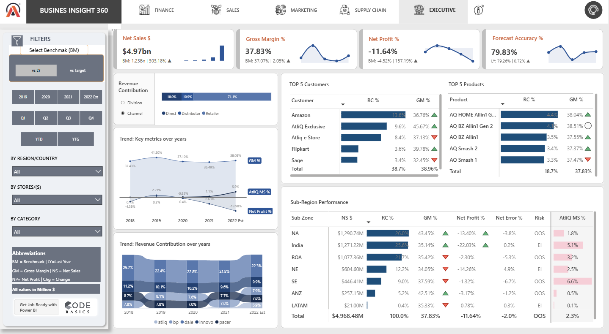
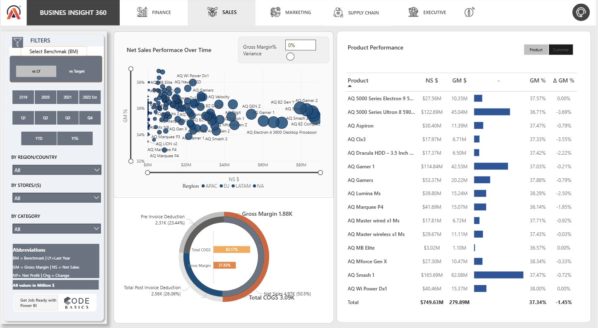
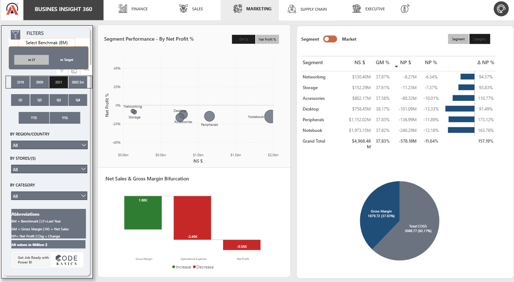
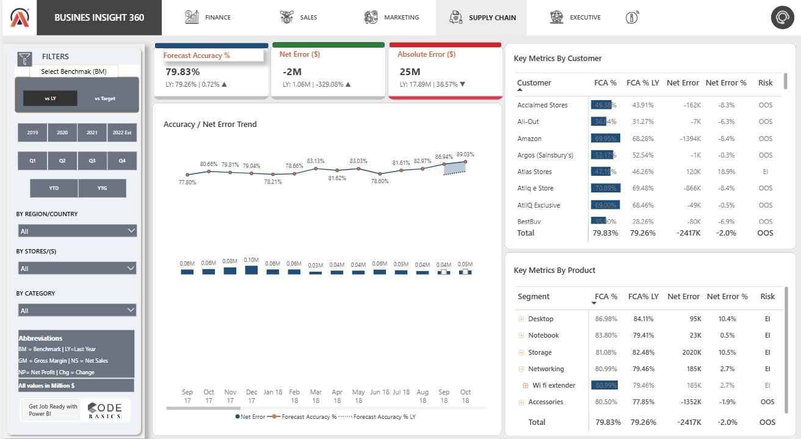
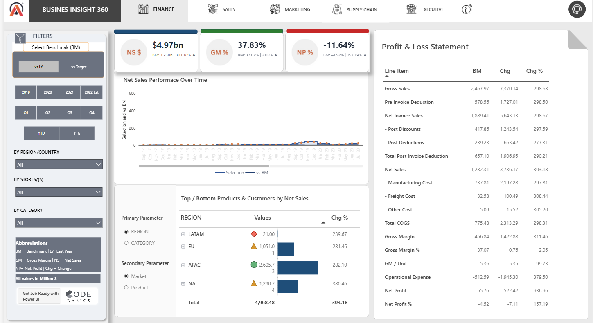

# 📊 Business Insight 360 – Power BI Dashboard

---

## 🚀 Live Dashboard  
🔗 https://app.powerbi.com/view?r=eyJrIjoiNzdiYmRlZDctNmFkMy00NWZjLThkMjMtMjdkYTcwZTI5MGVmIiwidCI6ImM2ZTU0OWIzLTVmNDUtNDAzMi1hYWU5LWQ0MjQ0ZGM1YjJjNCJ9

---

## 📌 Overview  

**Business Insight 360** is an end-to-end Business Intelligence solution designed to provide a unified view across key business functions:

- Sales  
- Finance  
- Marketing  
- Supply Chain  
- Executive Reporting  

The dashboard enables stakeholders to track KPIs, monitor trends, and make data-driven decisions through an interactive and intuitive interface.

---

## 🎯 Problem Statement  

Organizations often rely on fragmented reports across departments, which leads to:

- Lack of centralized KPI tracking  
- Inconsistent reporting across functions  
- Delayed and inefficient decision-making  

---

## 💡 Solution  

Developed a centralized Power BI dashboard integrating multiple datasets and business domains to:

- Track KPIs like **Net Sales, Gross Margin %, Net Profit %**  
- Monitor **Forecast Accuracy and Net Error trends**  
- Analyze **customer and product performance**  
- Enable dynamic filtering by **region, category, and time**  

---

## 🧰 Tools & Technologies  

- 📊 Power BI  
- 🧠 DAX (Data Analysis Expressions)  
- 🗄️ SQL  
- 📑 Excel  
- 🏗️ Data Modeling  

---

## 📊 Key Features  

- Interactive dashboards with drill-down capabilities  
- KPI tracking across multiple business functions  
- Forecast accuracy & error trend analysis  
- Region-wise and product-wise performance insights  
- Clean and consistent UI/UX design  

---

## 📸 Dashboard Preview  

### Executive View  

### Sales View  

### Marketing View  

### Supply Chain View  

### Finance View  

---

## 📈 Business Impact  

- Improved visibility into cross-functional business performance  
- Enabled faster, data-driven decision-making  
- Identified trends in forecast accuracy and operational inefficiencies  
- Consolidated reporting into a single, scalable BI solution  

---

## 🧠 Key Learnings  

- Advanced DAX for KPI and variance calculations  
- Designing dashboards with strong visual hierarchy  
- Building scalable data models across multiple domains  
- Applying business context to data visualization  

---

## 📂 Repository Structure  

business-insight-360-powerbi-dashboard/
│
├── Dashboard/
│ └── Business_Insight_360.pbix
│
├── Screenshots/
│ ├── thumbnail.png
│ ├── executive_view.png
│ ├── sales_view.png
│ ├── marketing_view.png
│ ├── supply_chain_view.png
│ └── finance_view.png
│
└── README.md

---

## 🔗 Connect With Me  

- LinkedIn: https://www.linkedin.com/in/orhti/

---

⭐ If you found this project useful, consider giving it a star!
